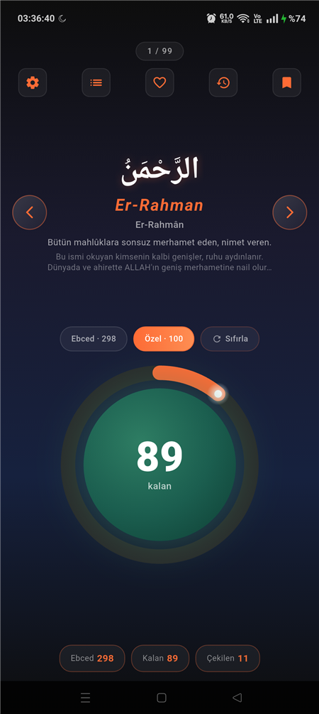
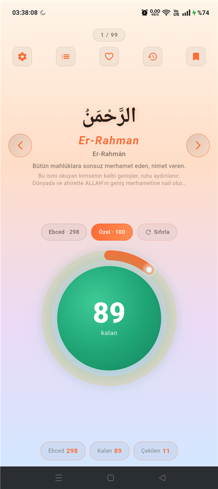
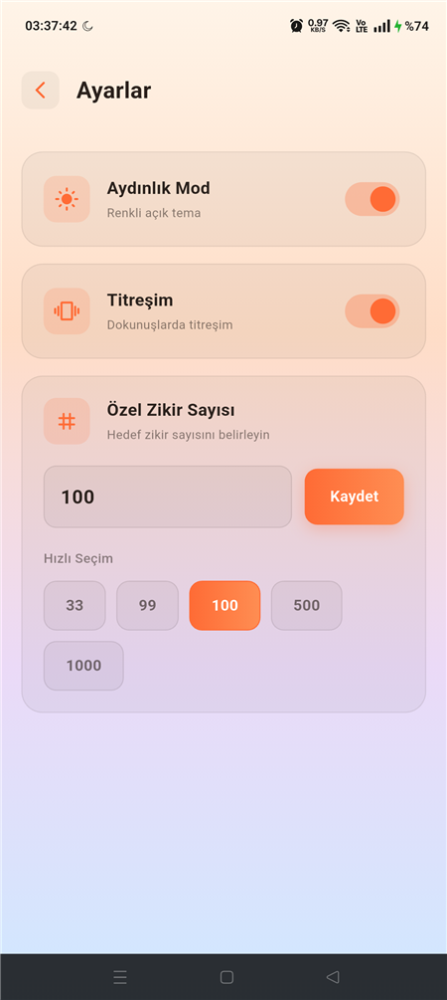
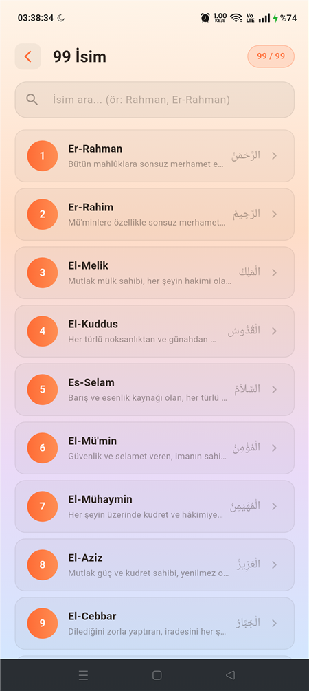
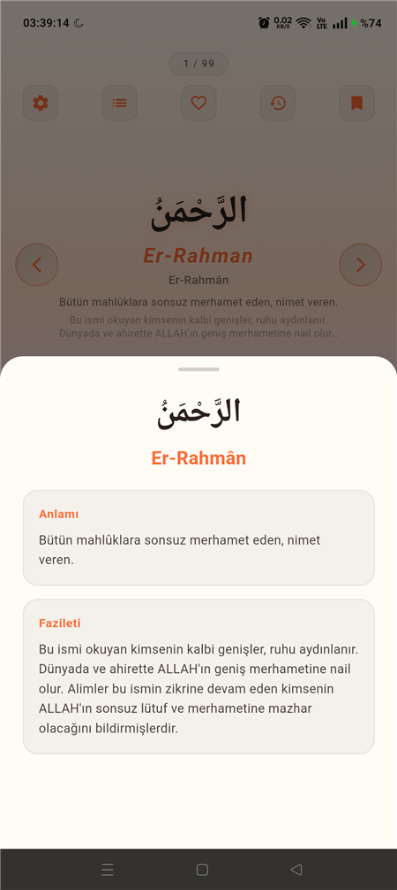
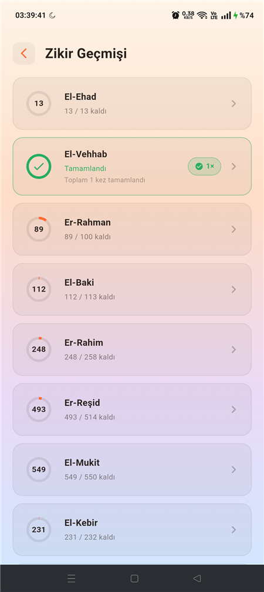
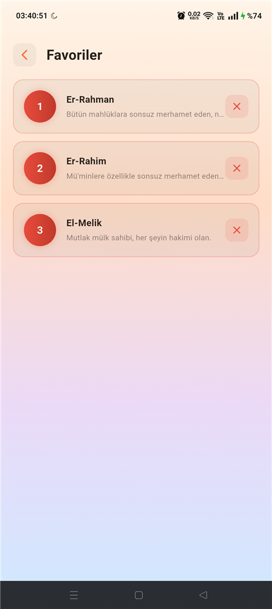

# Esma-ül Hüsnâ 🌙

Allah'ın 99 güzel ismi (Esmâ-i Hüsnâ) için tasarlanmış, sade ve şık bir **zikirmatik / dijital tesbih** uygulaması. Flutter ile geliştirilmiştir.

Her isim; Arapça yazılışı, okunuşu, Türkçe anlamı, fazileti ve ebced değeriyle birlikte sunulur. Dokunmatik sayaç, huzurlu animasyonlar ve zikir takibi ile modern bir deneyim sağlar.

## ✨ Özellikler

- **99 isim** — Arapça, Latin okunuş, Türkçe okunuş, anlam ve fazilet bilgileriyle
- **Zikirmatik sayaç** — ekrana dokunarak zikir çekme, kalan sayı büyük ve net gösterim
- **İki hedef modu** — her ismin **ebced** değeri ya da kendi belirlediğin **özel** sayı (33, 99, 100…)
- **Aydınlık & Karanlık tema** — ayarlardan tek dokunuşla geçiş; koyu lacivert tema ya da renkli açık tema (krem → şeftali → leylak → mavi geçişli). Tercih kalıcı olarak saklanır.
- **Işık patlaması dokunuş efekti** — her dokunuşta dokunulan noktada beliren, dışa saçılan sıcak ışık parıltısı
- **Kilometre taşı** animasyonu — her %10 ilerlemede kalan sayı parlayarak yukarı süzülür
- **Profesyonel isim geçiş okları** — cam efektli sağ/sol butonlar; isim değişirken yöne duyarlı kayma animasyonu
- **Onaylı sıfırlama** — yanlış dokunuşları önlemek için "Emin misiniz?" diyaloğu
- **Titreşim geri bildirimi** (açılıp kapatılabilir)
- **Kısayollar / favoriler** — sık kullandığın isimleri kaydet, tek dokunuşla geç, kolayca kaldır
- **Ana ekran widget'ı (Android)** — son kalınan zikri ana ekranda gösterir; **"+ Çek"** ile uygulamayı açmadan doğrudan ana ekrandan zikir çekilir, sayaç ve ilerleme uygulamayla senkron kalır
- **Zikir geçmişi** — ilerleme durumu ve her ismin **kaç kez tamamlandığı**
- **Tüm ekran boyutlarına uyum** — telefon, tablet ve masaüstünde orantısal ölçekleme (responsive)
- **Kolay gezinme** — kenarlardaki geçiş okları ve "3 / 99" konum göstergesi

## 📱 Ekran Görüntüleri

| Ana Ekran (Karanlık) | Ana Ekran (Aydınlık) | Ayarlar (Tema) |
|:---:|:---:|:---:|
|  |  |  |

| 99 İsim | İsim Detayı | Zikir Geçmişi |
|:---:|:---:|:---:|
|  |  |  |

| Favoriler |
|:---:|
|  |

## 🛠️ Teknolojiler

- [Flutter](https://flutter.dev/) & Dart
- [shared_preferences](https://pub.dev/packages/shared_preferences) — yerel veri saklama (favoriler, geçmiş, ayarlar, tema tercihi)
- `HapticFeedback` (flutter/services) — dokunuş titreşimi
- Merkezi tema sistemi (`AppPalette` + `ThemeScope`) ile aydınlık/karanlık mod
- Özel `CustomPainter` çizimleri (dairesel ilerleme, ışık patlaması efekti)

## 🚀 Kurulum

Gereksinim: [Flutter SDK](https://docs.flutter.dev/get-started/install) (3.11+)

```bash
# Bağımlılıkları yükle
flutter pub get

# Uygulamayı çalıştır (bağlı cihaz/emülatör ile)
flutter run
```

### APK oluşturma

```bash
flutter build apk --release
# Çıktı: build/app/outputs/flutter-apk/app-release.apk
```

## 📂 Proje Yapısı

```
lib/
├── main.dart                  # Uygulama girişi + tema kurulumu
├── data/esma_data.dart        # 99 ismin verisi (Arapça, anlam, fazilet, ebced)
├── models/                    # EsmaModel, ZikirHistory
├── screens/                   # Zikir, isim listesi, geçmiş, favoriler, ayarlar
├── services/                  # Depolama ve titreşim servisleri
├── theme/app_theme.dart       # Renk paleti + aydınlık/karanlık tema kontrolü
└── widgets/                   # Dairesel ilerleme, ışık patlaması, kilometre taşı
```

## 📝 Not (Ebced değerleri hakkında)

Ebced esaslı zikir sayılarının kesin bir dinî dayanağı bulunmamakla birlikte, halk arasında yaygın olarak benimsenmiş bir uygulamadır. Uygulamada bu değerler bilgi ve isteğe bağlı bir hedef seçeneği olarak sunulur; dilerseniz **Özel** moddan kendi sayınızı belirleyebilirsiniz.

## 🤝 Katkı

Katkılar, hata bildirimleri ve öneriler memnuniyetle karşılanır. Bir issue açabilir veya pull request gönderebilirsiniz.

## 📄 Lisans

Bu proje [MIT Lisansı](LICENSE) ile lisanslanmıştır.
